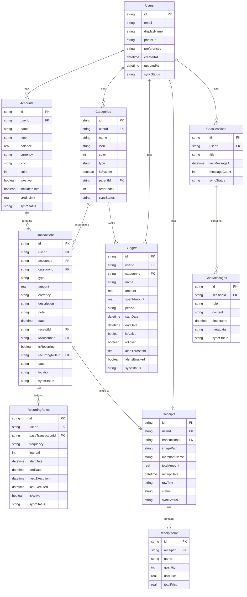

# Finance Assistant

> AI-Powered Personal Finance Assistant built with Flutter

A feature-rich mobile application that showcases practical AI integration, solves real-world financial management problems, and demonstrates full-stack mobile development skills with Clean Architecture.

---

## 📱 Core Features

### AI-Powered Features

| Feature | Description |
|---------|-------------|
| **Smart Expense Categorization** | Automatically categorize transactions using NLP |
| **Spending Pattern Analysis** | ML-based insights on spending habits |
| **Budget Recommendations** | AI suggests personalized budgets based on income/expenses |
| **Receipt Scanner (OCR)** | Extract data from receipts using computer vision |
| **Conversational Interface** | Chat with your finances using natural language |
| **Anomaly Detection** | Alert users to unusual spending patterns |

### Standard Features

- Manual expense/income tracking
- Visual dashboards with charts
- Multiple account support
- Recurring transactions
- Export reports (PDF/CSV)
- Dark/Light theme
- Biometric authentication
- **Offline-first architecture** with cloud sync

---

## 🛠️ Tech Stack

### Frontend
| Technology | Purpose |
|------------|---------|
| **Flutter** | Cross-platform mobile development |
| **Dart** | Programming language |
| **BLoC** | State management pattern |
| **Drift** | Local SQLite database (offline-first) |

### Backend
| Technology | Purpose |
|------------|---------|
| **Firebase Auth** | User authentication |
| **Cloud Firestore** | Remote database & sync |
| **Cloud Functions** | AI processing, serverless backend |
| **Firebase ML** | On-device ML capabilities |

### AI/ML Services

| Service | Use Case |
|---------|----------|
| **Google Gemini API** | Conversational AI, insights generation |
| **OpenAI GPT-4** | Alternative for chat & analysis |
| **Google ML Kit** | On-device OCR for receipts |
| **TensorFlow Lite** | On-device expense categorization |

---

## 📁 Project Structure

```
lib/
├── core/                           # Shared utilities & config
│   ├── constants/                  # App-wide constants
│   │   ├── app_constants.dart
│   │   └── database_constants.dart
│   ├── errors/                     # Error handling
│   │   ├── failures.dart
│   │   └── exceptions.dart
│   ├── sync/                       # Offline-first sync system
│   │   ├── sync_manager.dart
│   │   ├── sync_queue_processor.dart
│   │   └── conflict_resolver.dart
│   ├── themes/                     # Theme configuration
│   │   └── app_theme.dart
│   ├── utils/                      # Helper functions
│   └── di/                         # Dependency injection
│
├── data/                           # Data layer
│   ├── models/                     # JSON-serializable models
│   │   ├── user_model.dart
│   │   ├── account_model.dart
│   │   ├── category_model.dart
│   │   ├── transaction_model.dart
│   │   ├── budget_model.dart
│   │   ├── recurring_rule_model.dart
│   │   ├── receipt_model.dart
│   │   ├── chat_message_model.dart
│   │   └── models.dart             # Barrel export
│   ├── repositories/               # Repository implementations
│   ├── datasources/
│   │   ├── local/                  # Drift database
│   │   │   ├── app_database.dart   # Main database class
│   │   │   ├── tables/
│   │   │   │   └── tables.dart     # 11 table definitions
│   │   │   └── daos/               # Data Access Objects
│   │   │       ├── users_dao.dart
│   │   │       ├── accounts_dao.dart
│   │   │       ├── categories_dao.dart
│   │   │       ├── transactions_dao.dart
│   │   │       ├── budgets_dao.dart
│   │   │       ├── recurring_rules_dao.dart
│   │   │       ├── receipts_dao.dart
│   │   │       ├── chat_dao.dart
│   │   │       ├── sync_queue_dao.dart
│   │   │       └── daos.dart       # Barrel export
│   │   └── remote/                 # Firebase services
│   └── services/
│       └── ai_service.dart         # AI service integrations
│
├── domain/                         # Domain layer (pure Dart)
│   ├── entities/                   # Business entities
│   │   ├── user.dart
│   │   ├── account.dart
│   │   ├── category.dart
│   │   ├── transaction.dart
│   │   ├── budget.dart
│   │   ├── recurring_rule.dart
│   │   ├── receipt.dart
│   │   ├── chat_message.dart
│   │   └── entities.dart           # Barrel export
│   ├── repositories/               # Repository interfaces
│   │   └── repositories.dart       # Barrel export
│   └── usecases/                   # Business logic
│
├── presentation/                   # Presentation layer
│   ├── screens/
│   │   ├── dashboard/
│   │   ├── transactions/
│   │   ├── analytics/
│   │   ├── chat/                   # AI Chat interface
│   │   └── settings/
│   ├── widgets/
│   │   └── glass_card.dart
│   └── bloc/                       # State management
│
└── main.dart                       # App entry point
```

---

## 🏗️ Architecture

The app follows **Clean Architecture** principles with three main layers:

```
┌─────────────────────────────────────────────────────────────┐
│                    PRESENTATION LAYER                        │
│  (UI, Widgets, Screens, BLoC)                               │
├─────────────────────────────────────────────────────────────┤
│                      DOMAIN LAYER                            │
│  (Entities, Use Cases, Repository Interfaces)               │
├─────────────────────────────────────────────────────────────┤
│                       DATA LAYER                             │
│  (Models, Repositories, DataSources, Services)              │
└─────────────────────────────────────────────────────────────┘
```

### Data Flow
```
UI → BLoC → UseCase → Repository → DataSource → Database/API
```

### Offline-First Strategy
1. All data writes go to local Drift database first
2. Changes are queued in `SyncQueue` table
3. Background sync pushes changes to Firestore
4. Conflict resolution uses timestamp-based strategy
5. UI always reads from local database for instant response

---

## 🗄️ Database Schema

### Tables Overview

| Table | Purpose |
|-------|---------|
| `Users` | User profiles and preferences |
| `Accounts` | Bank accounts, wallets, credit cards |
| `Categories` | Transaction categories (system + custom) |
| `Transactions` | All financial transactions |
| `Budgets` | Budget limits per category/period |
| `RecurringRules` | Recurring transaction definitions |
| `Receipts` | OCR-scanned receipt data |
| `ReceiptItems` | Individual items from receipts |
| `ChatMessages` | AI conversation messages |
| `ChatSessions` | Chat conversation sessions |
| `SyncQueue` | Offline sync queue |

### Sync Status Values
- `synced` - Synchronized with remote
- `pending` - Local changes awaiting sync
- `failed` - Sync failed, needs retry
- `syncing` - Currently being synced
- `conflict` - Requires conflict resolution

### ER Diagram



---

## ✅ Implementation Status

### Completed
- [x] Project structure setup
- [x] Core constants (`app_constants.dart`, `database_constants.dart`)
- [x] Core errors module (`failures.dart`, `exceptions.dart`)
- [x] Theme system (`app_theme.dart` - Light/Dark)
- [x] Sync manager system
- [x] Dashboard UI with widgets
- [x] Domain entities (8 entities)
- [x] Domain repository interfaces (9 repositories)
- [x] **Data models** (8 JSON-serializable models with Firestore support)
- [x] **Drift database** (`app_database.dart` with migrations)
- [x] **Database tables** (11 tables)
- [x] **DAOs** (9 Data Access Objects with full CRUD)

### In Progress
- [ ] Repository implementations
- [ ] BLoC state management

### Planned
- [ ] Firebase integration
- [ ] AI service integration (Gemini, OpenAI)
- [ ] Receipt scanner with ML Kit
- [ ] Chat interface
- [ ] Analytics charts
- [ ] Settings screen
- [ ] Authentication flows

---

## 🚀 Getting Started

### Prerequisites
- Flutter SDK >= 3.0.0
- Dart >= 3.0.0
- Firebase project configured

### Installation

1. Clone the repository
```bash
git clone https://github.com/yourusername/flutter_finance_assistant.git
cd flutter_finance_assistant
```

2. Install dependencies
```bash
flutter pub get
```

3. Generate code (Drift, JSON serialization)
```bash
dart run build_runner build --delete-conflicting-outputs
```

4. Configure Firebase
```bash
flutterfire configure
```

5. Run the app
```bash
flutter run
```

### Environment Variables

Create a `.env` file in the project root:
```env
GEMINI_API_KEY=your_gemini_api_key
OPENAI_API_KEY=your_openai_api_key
```

---

## 🎨 Why This Project Stands Out

1. **Practical AI Integration** - Not just a gimmick, AI adds real value
2. **Complex State Management** - Shows architectural skills with BLoC
3. **Multiple Data Sources** - Local (Drift) + Remote (Firestore) + AI services
4. **Offline-First** - Full functionality without internet
5. **Real-World Problem** - Everyone needs financial management
6. **Portfolio-Ready UI** - Charts, dashboards, glassmorphism design
7. **Scalable Architecture** - Clean Architecture demonstrates senior-level thinking

---

## 📚 Documentation

See the `.cursor/` folder for detailed documentation:
- `context.md` - Project overview and status
- `api_reference.md` - API quick reference
- `components.mdc` - Component creation guidelines
- `rules.md` - Development standards

---

## 📄 License

This project is licensed under the MIT License.
